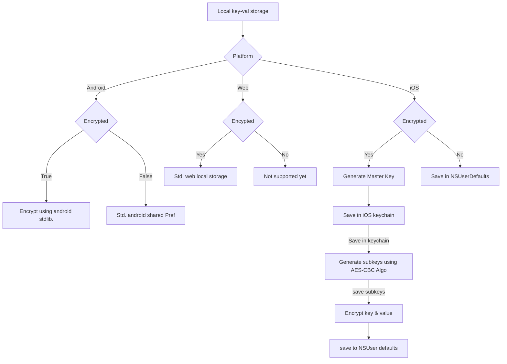

<!-- 
This README describes the package. If you publish this package to pub.dev,
this README's contents appear on the landing page for your package.

For information about how to write a good package README, see the guide for
[writing package pages](https://dart.dev/guides/libraries/writing-package-pages). 

For general information about developing packages, see the Dart guide for
[creating packages](https://dart.dev/guides/libraries/create-library-packages)
and the Flutter guide for
[developing packages and plugins](https://flutter.dev/developing-packages). 
-->


[](https://pub.dev/packages/secure_shared_preferences/score)
[](https://pub.dev/packages/secure_shared_preferences)
## Features

- Simple to use yet powerful package to encypt shared preferences in android and UserDefaults in iOS.
- You have an option to by pass encryption just by passing a ```bool```.
- Supports ```String, int, bool, double, map and List<String>```.
- Uses advance ```AES-CBC-128``` algorithm for encryption.
- Encrypts both key and value.
- Integration unit tests available [here](./example/integration_test/app_test.dart)

## Getting started

1. add dependency in ``` pubspec.yaml``` file ```secure_shared_preferences:0.0.1-beta```
2. add import  ```import 'package:secure_shared_preferences/secure_shared_preferences.dart';```

## Usage
1. To save string data type to secure storage.
```dart
    var pref = await SecureSharedPref.getInstance();
    pref.putString("Key", "This is data I want to save to local storage", true);
```
1. To get string data type to secure storage.
```dart
    var pref = await SecureSharedPref.getInstance();
    pref.getString("Key", true);
```

## Additional information
#### Encryption flow chart

#### Usage
1. Save :
```
    var pref = await SecureSharedPref.getInstance();
    await pref.putString("StringEncrypted", "This is my first string test", true);
    await pref.putInt("key", 100, true);
    await pref.putMap("mapKey", {"Hello":true}, true);
    await pref.putDouble("doubleKey", 20.32, true);
    await pref.putBool("boolKey", true, true);
    await pref.putStringList("listKey", ["S","K"], true);
```
2. Fetch :
```
    var pref = await SecureSharedPref.getInstance();
    await pref.getString("StringEncrypted", true);
    await pref.getInt("key", true);
    await pref.getMap("mapKey", true);
    await pref.getDouble("doubleKey", true);
    await pref.getBool("boolKey",true);
    await pref.getStringList("listKey", true);
```